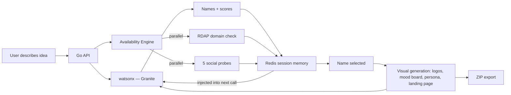

# NomVox — Born from the Void

> **AI-powered brand identity platform.**
> From a single idea to a complete brand universe — coined names, availability checks, logo concepts, mood boards, and a landing page mockup — synthesized in one session.

Built for the **AI Builders Challenge with IBM Bob · July 2026 · Creative Industries**
**Primary development tool: IBM Bob**

[](https://nomvox.vercel.app)
[](https://youtu.be/Kt73AI9WI8o)
[](https://nomvox-api.fly.dev/api/ping)
[](http://ibm.biz/university-bob)

---

## Problem Statement

Naming a brand means opening ten tabs — a thesaurus, a domain registrar, five social apps, a logo tool, a blank design file — and spending days before having anything shareable. Static name-generator tools make it worse: there's no way to say "I liked #3 but want it shorter" and have the tool actually respond.

**NomVox closes that gap.** It's a creative partner, not a generator — it remembers what you liked, what you rejected, and why, and gets sharper with every reaction.

---

## Solution

One idea in, a full brand out:

- **Coined names** — invented words, never dictionary terms, each with a tagline, origin story, and tone reasoning
- **Brand score** — Memorability, Spellability, Global Safety, Squatter Risk
- **Brand voice samples** — Instagram caption, email subject, 404 message
- **Live availability** — `.com` domain + five social platforms, checked in parallel before a name is ever shown
- **Competitor radar** — flags semantic overlap with known brands in the category

Liking, passing (with a reason), or choosing a name feeds directly into the next AI call — passing triggers one clarifying question, and every prior reaction shapes what comes next. This is the **creative-partner loop**.

Once a name is picked: three logo directions, a four-panel mood board, a brand persona card, and a landing page mockup — all from one consistent palette. Everything exports as a ZIP.

---

## Selected Challenge Theme

**July Challenge — Reimagine Creative Industries with AI**

| Solution area | How NomVox addresses it |
|---|---|
| AI Creative Partner | Session memory — every like/pass/note shapes the next generation |
| Creative Ideation & Brainstorming | Multi-strategy coined-name generation with scoring |
| AI-Powered Design & Visual Concept Tools | Logos, mood board, and landing page from one brand system |
| Personalized Creative Assistant | No two sessions produce the same output |

---

## AI Approach & Architecture

**Model.** All AI reasoning runs on **IBM watsonx.ai with IBM Granite** — names, origin stories, scoring, voice samples, competitor radar, persona cards, SVG logos, mood board tiles, and landing page HTML. Auth is IBM Cloud IAM (API key → Bearer token, cached 50 min).



**Concurrency.** Go's `sync.WaitGroup` runs six availability probes and four visual-generation tasks in parallel — a session that would take 30+ seconds serialized completes in a few seconds.

**Session memory is the core mechanism.** Every like, pass-with-reason, slider move, and clarifying answer persists in Redis and is re-injected into the next watsonx call. Reject a name as "too playful" and the next batch is generated against that constraint — it's a conversation, not a list generator.

**No broken states.** Every AI-generated asset has a deterministic CSS/SVG fallback, built from the user's actual inputs, if a watsonx call fails or quota runs out. The app never shows a blank screen regardless of upstream API health — this matters for a live demo where quota is genuinely unpredictable.

---

## How IBM Bob Was Used

IBM Bob was the primary development tool across the full build, used as a conversational pair-programmer:

- **Built by conversation** — features were described in plain language; Bob wrote the implementation and iterated through follow-up questions rather than one-shot prompts
- **Debug loop** — the most common pattern: paste an error → Bob diagnoses the root cause → Bob patches the file directly
- **Cross-stack context** — Bob held the Go backend, Next.js/TypeScript frontend, and deployment config (Fly.io, Vercel) together, which mattered for bugs spanning multiple layers
- **Docs from conversation** — this README and the SDLC plan were produced by asking Bob to summarize what had been built, rather than writing documentation separately after the fact
- **Full SDLC** — architecture through active production debugging (deployment failures, dependency conflicts, watsonx auth setup) to final docs, as the one consistent tool throughout

---

## Feasibility & Real-World Impact

- **Live today** at [nomvox.vercel.app](https://nomvox.vercel.app)
- **No broken demo state** — fallbacks mean it works regardless of AI quota at judging time
- **Real output** — full ZIP export, immediately usable by a developer, printer, or registrar
- **Universal need** — anyone launching anything needs a name and handle first

---

## Core Features

| Capability | What it does |
|---|---|
| Coined name generation | 5 invention strategies: syllable forge · phonaesthetics · neologism splice · void-word · ancient root mutation |
| Origin stories | Etymology and sound-symbolism reasoning per name |
| Brand scoring | Memorability · Spellability · Global Safety · Squatter Risk, with reasoning |
| Brand voice samples | Instagram caption · Email subject · 404 message |
| Live availability engine | Parallel RDAP domain check + HEAD probes: Instagram · X · TikTok · Threads · YouTube |
| 60% availability gate | Names must clear a weighted threshold; zero-pass fallback shows top-2 partials |
| Session memory | Liked/rejected/notes persist in Redis, injected into every AI call |
| Anti-name reasoning | AI asks one clarifying question on a rejection with a note |
| Style DNA sliders | Playful↔Premium and Abstract↔Descriptive, shift tone in real time |
| Competitor radar | Second AI pass flags semantic overlap with known brands |
| Logo concepts | 3 CSS/SVG styles: Geometric Bauhaus · Glassmorphic app icon · Horizontal wordmark |
| Mood board | 4-panel palette-driven board: Colour World · Brand Identity · Pattern DNA · Typography |
| Brand persona | Age, occupation, voice, what it reads, what it never says |
| Landing page mockup | AI HTML/CSS hero section with CSS fallback, sandboxed iframe |
| Export ZIP | brand-brief.json/html · logos/ · mood-board/ · landing-page.html · README.txt |

---

## IBM Technologies at the Core

| Technology | Role |
|---|---|
| **IBM Bob** | Primary development tool — see [How IBM Bob Was Used](#how-ibm-bob-was-used) |
| **IBM watsonx.ai** | Hosts all AI reasoning |
| **IBM Granite** | Primary model, called via watsonx's chat completion API |
| **IBM Cloud IAM** | API key → Bearer token exchange, cached 50 min |

---

## Tech Stack

| Layer | Technology |
|---|---|
| Backend | Go · chi router · archive/zip · sync.WaitGroup |
| Frontend | Next.js · React · TypeScript · Tailwind CSS · Zod |
| AI | IBM watsonx.ai (IBM Granite) |
| Session store | Redis via Upstash |
| Availability | RDAP (Verisign) + parallel HTTP HEAD probes |
| Deployment | Fly.io (API) · Vercel (frontend) |
| Font | Space Grotesk |

---

## Quick Start

```bash
# 1. Copy env template and fill in credentials
cp .env.example .env
# Required: WATSONX_API_KEY, WATSONX_PROJECT_ID, WATSONX_URL, REDIS_URL
# Optional: GOOGLE_AI_API_KEY (Imagen fallback for raster logo/mood-board images)

# 2. Start the Go API (port 8080)
go run ./cmd/server

# 3. Start the frontend (port 3000)
cd frontend && npm install && npm run dev
```

Open `http://localhost:3000`.

---

## Demo

- **Live app:** https://nomvox.vercel.app
- **Demo video:** https://youtu.be/Kt73AI9WI8o

---

## Team

| Member | Role | IBM SkillsBuild |
|---|---|---|
| c-annabel | Full-stack · AI integration · Design | *Uploaded* |

---

*© 2026 c-annabel — Developed with IBM Bob — AI Builders Challenge with IBM Bob — All rights reserved.*
*AI-generated brand assets are creative inspiration. Verify name availability before registration.*
