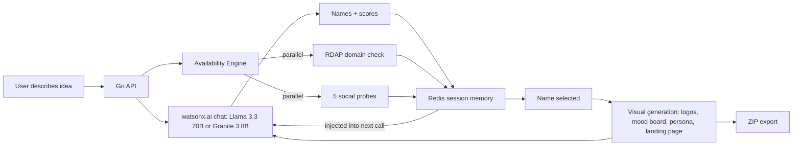

# NomVox — Born from the Void

> **AI-powered brand identity platform.**
> From a single idea to a complete brand universe — coined names, availability checks, logo concepts, mood boards, and a landing page mockup — synthesized in one session.

Built for the **AI Builders Challenge with IBM Bob · July 2026 · Creative Industries**
**Primary development tool: IBM Bob**

[](https://nomvox.vercel.app)
[](https://youtu.be/Q4dLLITmxH4)
[](https://nomvox-api.fly.dev/api/ping)
[](https://bob.ibm.com/)

---

## Problem Statement

Naming a brand means opening ten tabs — a thesaurus, a domain registrar, five social apps, a logo tool, a blank design file — and spending days before having anything shareable. Static name-generator tools make it worse: there's no way to say "I liked #3 but want it shorter" and have the tool actually respond.

**NomVox closes that gap.** It's a creative partner, not a generator — it remembers what you liked, what you rejected, and why, and gets sharper with every reaction.

---

## Solution

One idea in, a full brand out:

- **Coined names** — invented words, never dictionary terms, each with a tagline, origin story, and tone reasoning
- **Brand score** — Memorability, Spellability, Global Safety, Squatter Risk
- **Brand voice samples** — Instagram caption, email subject, 404 message
- **Live availability** — `.com` domain + five social platforms, checked in parallel before a name is ever shown
- **Competitor radar** — flags semantic overlap with known brands in the category

Liking, passing (with a reason), or choosing a name feeds directly into the next AI call — passing triggers one clarifying question, and every prior reaction shapes what comes next. This is the **creative-partner loop**.

Once a name is picked: three logo directions, a brand system mood board, a brand persona card, and a landing page mockup, all from one consistent palette. Everything exports as a ZIP.

---

## Selected Challenge Theme

**July Challenge — Reimagine Creative Industries with AI**

| Solution area | How NomVox addresses it |
|---|---|
| AI Creative Partner | Session memory — every like/pass/note shapes the next generation |
| Creative Ideation & Brainstorming | Multi-strategy coined-name generation with scoring |
| AI-Powered Design & Visual Concept Tools | Logos, mood board, and landing page from one brand system |
| Personalized Creative Assistant | No two sessions produce the same output |

---

## AI Approach & Architecture

**Models.** All reasoning runs on **IBM watsonx.ai**. The model is selected automatically from the configured endpoint region: `ca-tor` serves Llama 3.3 70B Instruct, `us-south` serves IBM Granite 3 8B Instruct. Both are called through the same watsonx chat completion API with identical prompts, so the deployment moves between them by changing one environment variable. Auth is IBM Cloud IAM, exchanging an API key for a Bearer token cached for 50 minutes.

Reasoning covers everything expressed as text: coined names, origin stories, brand scores, voice samples, competitor radar, persona cards, SVG logo markup, SVG mood board tiles, and landing page HTML.

Raster image generation runs on **Google Gemini 2.5 Flash Image** for logo concepts and mood board textures. watsonx does not currently offer a native image generation model, so the two providers split the work by capability rather than preference.


```mermaid
flowchart LR
    A[User describes idea] --> B[Go API]
    B --> C[watsonx.ai chat: Llama 3.3 70B or Granite 3 8B]
    C --> D[Names + scores]
    B --> E[Availability Engine]
    E -->|parallel| F[RDAP domain check]
    E -->|parallel| G[5 social probes]
    D --> H[Redis session memory]
    F --> H
    G --> H
    H -->|injected into next call| C
    H --> I[Name selected]
    I --> J[Visual generation: logos, mood board, persona, landing page]
    J --> C
    J --> K[ZIP export]
```

**Concurrency.** Go's `sync.WaitGroup` runs six availability probes and four visual-generation tasks in parallel — a session that would take 30+ seconds serialized completes in a few seconds.

**Session memory is the core mechanism.** Every like, pass-with-reason, slider move, and clarifying answer persists in Redis and is re-injected into the next watsonx call. Reject a name as "too playful" and the next batch is generated against that constraint — it's a conversation, not a list generator.

**No broken states.** Every AI-generated asset has a deterministic fallback built from the user's actual inputs. The chain runs Gemini, then watsonx SVG, then a CSS brand system rendered from the parsed colour palette. The app never shows a blank screen regardless of upstream API health, which matters for a live demo where quota is genuinely unpredictable.

The fallbacks are validated rather than trusted. Generated SVG is rejected if it is truncated or malformed, and generated HTML is rejected if it does not reach its closing tags. A rejected asset falls through to the next tier instead of rendering broken.

---

## Why Two AI Providers

The build uses IBM watsonx.ai and Google Gemini for different jobs. The split is a capability boundary, not a preference.

**watsonx.ai handles reasoning.** Every output that is fundamentally text goes through it: inventing a name, explaining why that name sounds the way it does, scoring it, writing a brand persona, and producing HTML and SVG markup. Markup counts as reasoning here because the model is writing code, not drawing.

**Gemini handles raster images.** Photographic textures and rendered logo concepts are pixels, not text. watsonx.ai does not currently expose a native image generation model, so this work goes elsewhere.

The dependency runs one way. If Gemini is unavailable the product still completes end to end, because watsonx can emit SVG markup and the frontend can render a full brand system from the parsed palette. The reverse is not true, which is why watsonx is described as the core and Gemini as an enhancement.

---

## Reliability Engineering

The visual pipeline is the part most exposed to third-party failure, so it carries the most defensive work.

**Data URI validation.** SVG returned by a language model is treated as untrusted input. It is checked for a closing tag, stripped of surrounding markdown fences, given an XML namespace if one is missing, and escaped for bare ampersands before being base64 encoded. Without the namespace a browser refuses to render an SVG loaded through an `img` tag, and it fails silently with no console error.

**Context budget.** Logo images are never sent to a language model. The landing page prompt carries a placeholder token, and the real data URI is substituted into the returned HTML afterwards. A single generated PNG can exceed a megabyte, which is enough on its own to overflow a 131k token context window.

**Payload budget.** Session state in Redis excludes images. Upstash rejects any request over 10 MB by closing the connection, and a full visual pack exceeds that. Only lightweight brand state is persisted.

**Startup verification.** The API pings Redis at boot and logs the result. Session writes are non-fatal by design, so without an explicit check a broken connection stays invisible behind successful HTTP responses.

**Measured effect.** Visual generation response size dropped from roughly 12.7 MB to 5.9 MB, and generation time from roughly 40 seconds to 29 seconds.

---

## How IBM Bob Was Used

IBM Bob was the primary development tool across the full build, used as a conversational pair-programmer:

- **Built by conversation** — features were described in plain language; Bob wrote the implementation and iterated through follow-up questions rather than one-shot prompts
- **Debug loop** — the most common pattern: paste an error → Bob diagnoses the root cause → Bob patches the file directly
- **Cross-stack context** — Bob held the Go backend, Next.js/TypeScript frontend, and deployment config (Fly.io, Vercel) together, which mattered for bugs spanning multiple layers
- **Docs from conversation** — this README and the SDLC plan were produced by asking Bob to summarize what had been built, rather than writing documentation separately after the fact
- **Full SDLC** — architecture through active production debugging (deployment failures, dependency conflicts, watsonx auth setup) to final docs, as the one consistent tool throughout

---

## Feasibility & Real-World Impact

- **Live today** at [nomvox.vercel.app](https://nomvox.vercel.app)
- **No broken demo state** — fallbacks mean it works regardless of AI quota at judging time
- **Real output** — full ZIP export, immediately usable by a developer, printer, or registrar
- **Universal need** — anyone launching anything needs a name and handle first

---

## Core Features

| Capability | What it does |
|---|---|
| Coined name generation | 5 invention strategies: syllable forge · phonaesthetics · neologism splice · void-word · ancient root mutation |
| Origin stories | Etymology and sound-symbolism reasoning per name |
| Brand scoring | Memorability · Spellability · Global Safety · Squatter Risk, with reasoning |
| Brand voice samples | Instagram caption · Email subject · 404 message |
| Live availability engine | Parallel RDAP domain check + HEAD probes: Instagram · X · TikTok · Threads · YouTube |
| 60% availability gate | Names must clear a weighted threshold; zero-pass fallback shows top-2 partials |
| Session memory | Liked/rejected/notes persist in Redis, injected into every AI call |
| Anti-name reasoning | AI asks one clarifying question on a rejection with a note |
| Style DNA sliders | Playful↔Premium and Abstract↔Descriptive, shift tone in real time |
| Competitor radar | Second AI pass flags semantic overlap with known brands |
| Logo concepts | 3 formats generated from a hex-resolved brand palette: flat vector mark, app icon, horizontal wordmark |
| Mood board | Brand system panel: exact colour swatches and typography specimen rendered from the parsed palette, two AI texture studies, and three logo lockups |
| Brand persona | Age, occupation, voice, what it reads, what it never says |
| Landing page mockup | AI HTML/CSS hero section, validated for completeness, with a CSS fallback, rendered in a locked-down iframe |
| Export ZIP | brand-brief.json/html · logos/ · mood-board/ · landing-page.html · README.txt |

---

## IBM Technologies at the Core

| Technology | Role |
|---|---|
| **IBM Bob** | Primary development tool, see [How IBM Bob Was Used](#how-ibm-bob-was-used) |
| **IBM watsonx.ai** | Hosts all reasoning, called through the chat completion API |
| **IBM Granite 3 8B Instruct** | The model served on the `us-south` endpoint |
| **Llama 3.3 70B Instruct** | The model served on the `ca-tor` endpoint, also hosted by IBM watsonx.ai |
| **IBM Cloud IAM** | API key to Bearer token exchange, cached 50 minutes |

---

## Tech Stack

| Layer | Technology |
|---|---|
| Backend | Go · chi router · archive/zip · sync.WaitGroup |
| Frontend | Next.js · React · TypeScript · Tailwind CSS · Zod |
| AI reasoning | IBM watsonx.ai (Llama 3.3 70B on ca-tor, Granite 3 8B on us-south) |
| AI images | Google Gemini 2.5 Flash Image |
| Session store | Redis via Upstash |
| Availability | RDAP (Verisign) + parallel HTTP HEAD probes |
| Deployment | Fly.io (API) · Vercel (frontend) |
| Font | Space Grotesk |

---

## Quick Start

```bash
# 1. Copy env template and fill in credentials
cp .env.example .env
# Required: WATSONX_API_KEY, WATSONX_PROJECT_ID, WATSONX_URL, REDIS_URL
# Optional: GOOGLE_AI_API_KEY (Gemini 2.5 Flash Image, for raster logos and mood board textures)

# 2. Start the Go API (port 8080)
go build -o nomvox-server.exe ./cmd/server
.\nomvox-server.exe


# 3. Start the frontend (port 3000)
cd frontend && (npm install && npm run dev)
npm run build    
```

Open `http://localhost:3000`.

---

## Demo

- **Live app:** https://nomvox.vercel.app
- **Demo video:** https://youtu.be/Q4dLLITmxH4

---

## Total Cost
 - **IBM Bob:** 40 Bobcoins (trial) + 235.843 units (160 unit: USD 60.8 + Overage: 0.72 + ?) = 275.843 units 
 - **Google AI Studio:** CA$25 prepaid data usage for image generation. 

 - **Total:** 25 + 97.16 ($85.98+Tax) + Overage Usage =  CA$122.16 + ?

---

## Team

| Member | Role | IBM SkillsBuild Courses|
|---|---|---|
| c-annabel | Software Engineer · AI integration · Full-stack developer · Design · Project Manager | Completed |

---

*AI-generated brand assets are creative inspiration. Verify name availability before registration.*

---

*© 2026 c-annabel — Developed with IBM Bob — AI Builders Challenge with IBM Bob — All rights reserved.*
